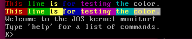

# Report for lab1, Yuchen Gu


## *All Challenge Accomplished*


## Environment Configuration

```
Hardware Environment:
Memory:         2GB
Processor:      Intel(R) Core(TM) i7-8750H CPU @ 2.20GHz
OS Type:        32 bit
Disk:           20GB

Software Environment:
OS:             Ubuntu 18.04.5 LTS
Gcc:            gcc (Ubuntu 7.5.0-3ubuntu1~18.04) 7.5.0
Make:           GNU Make 4.1
Gdb:            GNU gdb (Ubuntu 8.1-0ubuntu3.2) 8.1.0.20180409-git

```

### Test Compiler Toolchain
```shell
$ objdump -i
BFD header file version (GNU Binutils for Ubuntu) 2.30
elf32-i386
...
$ gcc -m32 -print-libgcc-file-name
/usr/lib/gcc/i686-linux-gnu/7/libgcc.a
```

### QEMU Emulator
Cloned from the IAP 6.828 QEMU git repository

## Part 1: PC Bootstrap

### Simulating the x86
```bash
llgyc@ubuntu:~/Desktop/6.828/lab$ make
+ as kern/entry.S
+ cc kern/entrypgdir.c
+ cc kern/init.c
+ cc kern/console.c
+ cc kern/monitor.c
+ cc kern/printf.c
+ cc kern/kdebug.c
+ cc lib/printfmt.c
+ cc lib/readline.c
+ cc lib/string.c
+ ld obj/kern/kernel
ld: warning: section `.bss' type changed to PROGBITS
+ as boot/boot.S
+ cc -Os boot/main.c
+ ld boot/boot
boot block is 390 bytes (max 510)
+ mk obj/kern/kernel.img
```
出现了一个**warning**，但查阅了StackOverflow后[^1], 我们认为这应该对本次lab没有太大影响

```bash
llgyc@ubuntu:~/Desktop/6.828/lab$ make qemu-nox
sed "s/localhost:1234/localhost:26000/" < .gdbinit.tmpl > .gdbinit
***
*** Use Ctrl-a x to exit qemu
***
qemu-system-i386 -nographic -drive file=obj/kern/kernel.img,index=0,media=disk,format=raw -serial mon:stdio -gdb tcp::26000 -D qemu.log 
6828 decimal is XXX octal!
entering test_backtrace 5
entering test_backtrace 4
entering test_backtrace 3
entering test_backtrace 2
entering test_backtrace 1
entering test_backtrace 0
leaving test_backtrace 0
leaving test_backtrace 1
leaving test_backtrace 2
leaving test_backtrace 3
leaving test_backtrace 4
leaving test_backtrace 5
Welcome to the JOS kernel monitor!
Type 'help' for a list of commands.
K> 
```

并且我们也成功启动了kernel

### The ROM BIOS

#### Exercise 2

通电后，首先运行的是位于地址0xffff0，BIOS最高地址部分的指令。 我们用gdb来看下最开始的一部分指令，

```
[f000:fff0]    0xffff0:	ljmp   $0xf000,$0xe05b
[f000:e05b]    0xfe05b:	cmpl   $0x0,%cs:0x6ac8
[f000:e062]    0xfe062:	jne    0xfd2e1
[f000:e066]    0xfe066:	xor    %dx,%dx
[f000:e068]    0xfe068:	mov    %dx,%ss
[f000:e06a]    0xfe06a:	mov    $0x7000,%esp
[f000:e070]    0xfe070:	mov    $0xf34c2,%edx
[f000:e076]    0xfe076:	jmp    0xfd15c
[f000:d15c]    0xfd15c:	mov    %eax,%ecx
[f000:d15f]    0xfd15f:	cli    
[f000:d160]    0xfd160:	cld    
```

因为是从最高地址部分开始执行的，所以需要先跳转到低地址处。然后BIOS做一些检测并且设置栈指针和Stack Segment寄存器，关闭中断并且设置传输方向为增长。

```
[f000:d161]    0xfd161:	mov    $0x8f,%eax
[f000:d167]    0xfd167:	out    %al,$0x70
[f000:d169]    0xfd169:	in     $0x71,%al
```

从这个port表[^2]中可以看出,  0x70和0x71都是用来设置CMOS RAM/RTC的，仔细看一下可以知道这部分是关闭NMI以及进行其它一些设置的。

```
[f000:d16b]    0xfd16b:	in     $0x92,%al
[f000:d16d]    0xfd16d:	or     $0x2,%al
[f000:d16f]    0xfd16f:	out    %al,$0x92
```

同样从表中我们可以知道这里是在启动A20地址线，以便后面可以进入32位保护模式。


```
[f000:d171]    0xfd171:	lidtw  %cs:0x6ab8
[f000:d177]    0xfd177:	lgdtw  %cs:0x6a74
[f000:d17d]    0xfd17d:	mov    %cr0,%eax
[f000:d180]    0xfd180:	or     $0x1,%eax
[f000:d184]    0xfd184:	mov    %eax,%cr0
[f000:d187]    0xfd187:	ljmpl  $0x8,$0xfd18f
```

这里是加载中断向量寄存器IDTR和描述符表寄存器GDTR，并且设置CR0的bit0为1（表示启动保护模式），然后长跳转改变CS寄存器以及最终进入保护模式。

```
The target architecture is assumed to be i386
=> 0xfd18f:	mov    $0x10,%eax
=> 0xfd194:	mov    %eax,%ds
=> 0xfd196:	mov    %eax,%es
=> 0xfd198:	mov    %eax,%ss
=> 0xfd19a:	mov    %eax,%fs
=> 0xfd19c:	mov    %eax,%gs
=> 0xfd19e:	mov    %ecx,%eax
=> 0xfd1a0:	jmp    *%edx
...
```

在干其它事情之前先要设置段寄存器，才能保证后面的指令不出错。后面的指令就不再分析，也是进行一些其它的检测和准备工作，直到最后从光驱中加载出bootloader并且把控制权转交给bootloader。

## Part 2: The Boot Loader

这部分做的事情主要是：

- 转入保护模式（boot.S）
- 将从1号扇区（0开始计数）开始的kernel根据ELF文件中的LMA装载进机器

#### Exercise 3

利用gdb逐行对比可以发现部分指令的地址发生了改变，但其实指令还是相同的

```
GDB:
   0x7c1e:	lgdtw  0x7c64
   0x7c23:	mov    %cr0,%eax
   0x7c26:	or     $0x1,%eax
   0x7c2a:	mov    %eax,%cr0
```

``` 
obj/boot/boot.asm:
  lgdt    gdtdesc
    7c1e:	0f 01 16             	lgdtl  (%esi)
    7c21:	64 7c 0f             	fs jl  7c33 <protcseg+0x1>
  movl    %cr0, %eax
    7c24:	20 c0                	and    %al,%al
  orl     $CR0_PE_ON, %eax
    7c26:	66 83 c8 01          	or     $0x1,%ax
  movl    %eax, %cr0
    7c2a:	0f 22 c0             	mov    %eax,%cr0
```

这里利用gdb查看运行时0x7c1e开始的8个字节可以发现：

```
(gdb) x/8b 0x7c1e
0x7c1e:	0x0f	0x01	0x16	0x64	0x7c	0x0f	0x20	0xc0
```

应该二进制文件是没有区别的，只不过asm中把0x7c21开始的三个字节解读错了，前两个字节应该跟着前一条指令，后一个字节应该跟着后一条指令，而且根据这部分的意义，明显是运行时gdb的解读正确（取出CR0，bit0置为1，写入CR0）。

练习要求的readsect()与汇编代码的对应在生成的boot.asm中已有很好的对应了，此处不再赘述。

- At what point does the processor start executing 32-bit code? What exactly causes the switch from 16- to 32-bit mode?

```
[   0:7c2d] => 0x7c2d:	ljmp   $0x8,$0x7c32
0x00007c2d in ?? ()
(gdb) 
The target architecture is assumed to be i386
=> 0x7c32:	mov    $0x10,%ax
0x00007c32 in ?? ()

```

从上可以很好的看出，bootloader从ljmp指令后进入了32位保护模式。具体造成转换的原因有：首先激活A20地址线，其次加载GDT并且将CR0的bit0置为1，最后长跳转改变CS段寄存器寻址方式发生转变。

- What is the *last* instruction of the boot loader executed, and what is the *first* instruction of the kernel it just loaded?

	obj/boot/boot.asm:
		((void (*)(void)) (ELFHDR->e_entry))();
	    7d6b:	ff 15 18 00 01 00    	call   *0x10018
上面这条进入kernel程序入口的的指令就是bootloader执行的最后一条指令，kernel的第一条指令是

```
Breakpoint 2, 0x00007d6b in ?? ()
(gdb) si
=> 0x10000c:	movw   $0x1234,0x472
```

- *Where* is the first instruction of the kernel?

由上面可以知道在0x10000c处

- How does the boot loader decide how many sectors it must read in order to fetch the entire kernel from disk? Where does it find this information?

这个是通过读取ELF文件的program header部分知道的，

```
llgyc@ubuntu:~/Desktop/6.828/lab$ readelf -a ./obj/kern/kernel
ELF Header:
  Magic:   7f 45 4c 46 01 01 01 00 00 00 00 00 00 00 00 00 
  Class:                             ELF32
  Data:                              2's complement, little endian
  Version:                           1 (current)
  OS/ABI:                            UNIX - System V
  ABI Version:                       0
  Type:                              EXEC (Executable file)
  Machine:                           Intel 80386
  Version:                           0x1
  Entry point address:               0x10000c
  Start of program headers:          52 (bytes into file)
  Start of section headers:          86776 (bytes into file)
  Flags:                             0x0
  Size of this header:               52 (bytes)
  Size of program headers:           32 (bytes)
  Number of program headers:         3
  Size of section headers:           40 (bytes)
  Number of section headers:         15
  Section header string table index: 14
...
Program Headers:
  Type           Offset   VirtAddr   PhysAddr   FileSiz MemSiz  Flg Align
  LOAD           0x001000 0xf0100000 0x00100000 0x0759d 0x0759d R E 0x1000
  LOAD           0x009000 0xf0108000 0x00108000 0x0b6a8 0x0b6a8 RW  0x1000
  GNU_STACK      0x000000 0x00000000 0x00000000 0x00000 0x00000 RWE 0x10
...
```

上面ELF header中的entry point address也可以看出kernel第一行代码的位置，下面program header的Offset就是读入开始的位置，MemSiz就是读入到内存的大小。kernel中这部分代码也印证了这一点：

```
boot/main.c:
	// load each program segment (ignores ph flags)
	ph = (struct Proghdr *) ((uint8_t *) ELFHDR + ELFHDR->e_phoff);
	eph = ph + ELFHDR->e_phnum;
	for (; ph < eph; ph++)
		// p_pa is the load address of this segment (as well
		// as the physical address)
		readseg(ph->p_pa, ph->p_memsz, ph->p_offset);
```

#### !!疑点1

关于boot/main.c这部分代码有些疑问：

```
// Read 'count' bytes at 'offset' from kernel into physical address 'pa'.
// Might copy more than asked
void
readseg(uint32_t pa, uint32_t count, uint32_t offset)
{
	uint32_t end_pa;

	end_pa = pa + count;

	// round down to sector boundary
	pa &= ~(SECTSIZE - 1);

	// translate from bytes to sectors, and kernel starts at sector 1
	offset = (offset / SECTSIZE) + 1;

	// If this is too slow, we could read lots of sectors at a time.
	// We'd write more to memory than asked, but it doesn't matter --
	// we load in increasing order.
	while (pa < end_pa) {
		// Since we haven't enabled paging yet and we're using
		// an identity segment mapping (see boot.S), we can
		// use physical addresses directly.  This won't be the
		// case once JOS enables the MMU.
		readsect((uint8_t*) pa, offset);
		pa += SECTSIZE;
		offset++;
	}
}
```

这个readseg函数仔细看就可以发现，其实现的功能并不是如同注释中描述的那样。首先，当pa不是SECTSIZE的倍数时，拷贝到的位置就不是传入的pa处，其次当offset和pa满足一定关系时，甚至都不能将offset开始的count个字节完整拷入进内存中。所幸的是，根据上一小节中program header的部分，offset和physaddr都是SECTSIZE(512=2^9)的倍数，因此实际运行过程不会出错。

### Loading the Kernel

这部分做的实际上就是根据ELF文件把上面提到的三个segment拷入进对应的PhysAddr或者说LMA位置上，然后从entry point开始将控制权转交给kernel。

#### Exercise 5

改变link address的结果就是会使得读取数据/远距离跳转时（即需要绝对地址的指令处）目标地址发生错误。比如我们将boot/Makefrag文件中改成-Ttext 0x8C00，那么可以看到：

```
   0x7c1e:	lgdtw  -0x739c
   0x7c23:	mov    %cr0,%eax
   0x7c26:	or     $0x1,%eax
   0x7c2a:	mov    %eax,%cr0
   0x7c2d:	ljmp   $0x8,$0x8c32
```

加载GDT的地址甚至变成了负数，而且跳转的位置明显时从0x7c32变成了0x8c32，并且程序确实在这里发生错误：

```
Program received signal SIGTRAP, Trace/breakpoint trap.
[   0:7c2d] => 0x7c2d:	ljmp   $0x8,$0x8c32
0x00007c2d in ?? ()
```

#### Exercise 6

刚进入bootloader时，数据如下：

```
Breakpoint 1, 0x00007c00 in ?? ()
(gdb) x/8x 0x100000
0x100000:	0x00000000	0x00000000	0x00000000	0x00000000
0x100010:	0x00000000	0x00000000	0x00000000	0x00000000
```

刚进入kernel时，数据如下：

```
Breakpoint 2, 0x0010000c in ?? ()
(gdb) x/8x 0x100000
0x100000:	0x1badb002	0x00000000	0xe4524ffe	0x7205c766
0x100010:	0x34000004	0x2000b812	0x220f0011	0xc0200fd8
```

理由非常简单，因为kernel其中一段被加载的位置刚好就是从0x100000开始，因此bootloader运行完后这个位置就会有数据写入，并且这就是kernel的代码，我们可以对比一下：

```
obj/kern/kernel.asm
.globl entry
entry:
	movw	$0x1234,0x472			# warm boot
f0100000:	02 b0 ad 1b 00 00    	add    0x1bad(%eax),%dh
f0100006:	00 00                	add    %al,(%eax)
f0100008:	fe 4f 52             	decb   0x52(%edi)
f010000b:	e4                   	.byte 0xe4
```

可以发现是完全一样的

## Part 3: The Kernel

### Using virtual memory to work around position dependence

这一段是说为了能将kernel在0xf0100000这样的高地址处link需要虚拟内存的概念，在lab1中我们先用一个暴力的4MB的映射，将物理地址0x0到0x400000映射到虚拟地址0xf0000000到0xf0400000的策略，其它部分的地址暂时用不到可以不管。

#### Exercise 7

`movl %eax, %cr0`相邻的几条指令是

```
mov    %cr0,%eax
or     $0x80010001,%eax
mov    %eax,%cr0
```

同时根据CR0各个位置的意义[^3]，可以知道这里是在开启保护模式、开启写保护、开启分页。

我们很容易想到如果注释这条指令，访问高地址0xf0100000时，不能自动映射到低地址0x00100000处了，可以验证一下。

注释前：

```
=> 0x100025:	mov    %eax,%cr0

Breakpoint 1, 0x00100025 in ?? ()
(gdb) x/8x 0x100000
0x100000:	0x1badb002	0x00000000	0xe4524ffe	0x7205c766
0x100010:	0x34000004	0x2000b812	0x220f0011	0xc0200fd8
(gdb) x/8x 0xf0100000
0xf0100000 <_start+4026531828>:	0x00000000	0x00000000	0x00000000	0x00000000
0xf0100010 <entry+4>:	0x00000000	0x00000000	0x00000000	0x00000000
(gdb) si
=> 0x100028:	mov    $0xf010002f,%eax
0x00100028 in ?? ()
(gdb) x/8x 0x100000
0x100000:	0x1badb002	0x00000000	0xe4524ffe	0x7205c766
0x100010:	0x34000004	0x2000b812	0x220f0011	0xc0200fd8
(gdb) x/8x 0xf0100000
0xf0100000 <_start+4026531828>:	0x1badb002	0x00000000	0xe4524ffe	0x7205c766
0xf0100010 <entry+4>:	0x34000004	0x2000b812	0x220f0011	0xc0200fd8
```

注释后：

```
=> 0x100020:	or     $0x80010001,%eax

Breakpoint 1, 0x00100020 in ?? ()
(gdb) x/8x 0x100000
0x100000:	0x1badb002	0x00000000	0xe4524ffe	0x7205c766
0x100010:	0x34000004	0x2000b812	0x220f0011	0xc0200fd8
(gdb) x/8x 0xf0100000
0xf0100000 <_start+4026531828>:	0x00000000	0x00000000	0x00000000	0x00000000
0xf0100010 <entry+4>:	0x00000000	0x00000000	0x00000000	0x00000000
(gdb) si
=> 0x100025:	mov    $0xf010002c,%eax
0x00100025 in ?? ()
(gdb) x/8x 0x100000
0x100000:	0x1badb002	0x00000000	0xe4524ffe	0x7205c766
0x100010:	0x34000004	0x2000b812	0x220f0011	0xc0200fd8
(gdb) x/8x 0xf0100000
0xf0100000 <_start+4026531828>:	0x00000000	0x00000000	0x00000000	0x00000000
0xf0100010 <entry+4>:	0x00000000	0x00000000	0x00000000	0x00000000

```

正符合我们的预期

### Formatted Printing to the Console

这一段要看的部分是一些输出函数，lib/printfmt.c中主要是格式串的控制输出，kern/printf.c提供了类似于我们常用的printf的接口，kern/console.c是一些控制输出到屏幕CGA、并行接口、串行接口的函数。

#### !!疑点2

这里有一个函数其实是有问题的，

```
kern/printf.c:
static void
putch(int ch, int *cnt)
{
	cputchar(ch);
	*cnt++;
}
```

其中`*cnt++`一行的作用本应该是使得统计输出总字符的值加1，其中cnt是指向那个变量的指针，所以这里应该改成`(*cnt)++`才合理，并且经过实验确实如此，修改前cprintf的返回值恒为0，修改后能够正确返回输出的字符个数。

#### Exercise 8

这个练习只要对着其它的输出写就好了：

```
lib/printfmt.c
		case 'o':
			num = getuint(&ap, lflag);
			base = 8;
			goto number;
```

先从可变参数列表取出要输出的数字，设置基数为8，然后跳转到输出数字的部分即可

- Explain the interface between `printf.c` and `console.c`. Specifically, what function does `console.c` export? How is this function used by `printf.c`?

`console.c`提供了`cputchar(int)`这个函数，`printf.c`中有着`cprintf`->`vcprintf`->`vprintfmt`（在`printfmt.c`中）->`putch`->`cputchar`的调用链

- Explain the following from `console.c`:

  ```
  1      if (crt_pos >= CRT_SIZE) {
  2              int i;
  3              memmove(crt_buf, crt_buf + CRT_COLS, (CRT_SIZE - CRT_COLS) * sizeof(uint16_t));
  4              for (i = CRT_SIZE - CRT_COLS; i < CRT_SIZE; i++)
  5                      crt_buf[i] = 0x0700 | ' ';
  6              crt_pos -= CRT_COLS;
  7      }
  ```

第1行判断字符是否大于console大小，第3行将从console第二行开始的所以文本向上平移一行，第4-5行将console最后一行清空，第6行重新计算当前光标位置。

其实整段代码就是当console显示满的时候让所有字符向上滚动一行以便能显示更多新字符

- For the following questions you might wish to consult the notes for Lecture 2. These notes cover GCC's calling convention on the x86.

  Trace the execution of the following code step-by-step:

  ```
  int x = 1, y = 3, z = 4;
  cprintf("x %d, y %x, z %d\n", x, y, z);
  ```

  - In the call to `cprintf()`, to what does `fmt` point? To what does `ap` point?

  fmt指向`"x %d, y %x, z %d\n"`这个字符串，ap指向第一个参数也就是x的起始地址

  - List (in order of execution) each call to `cons_putc`, `va_arg`, and `vcprintf`. For `cons_putc`, list its argument as well. For `va_arg`, list what `ap` points to before and after the call. For `vcprintf` list the values of its two arguments.

  ```
  vcprintf("x %d, y %x, z %d\n",{x,y,z}) 
  ->cons_putc('x')
  ->cons_putc(' ')
  ->va_arg() ap从指向x的起始地址变成指向y的起始地址
  ->cons_putc('1')
  ->cons_putc(',')
  ->cons_putc(' ')
  ->cons_putc('y')
  ->cons_putc(' ')
  ->va_arg() ap从指向y的起始地址变成指向z的起始地址
  ->cons_putc('3')
  ->cons_putc(',')
  ->cons_putc(' ')
  ->cons_putc('z')
  ->cons_putc(' ')
  ->va_arg() ap从指向z的起始地址变成指向z的结束地址的下一个位置
  ->cons_putc('4')
  ->cons_putc('\n')
  ```

- Run the following code.

  ```
      unsigned int i = 0x00646c72;
      cprintf("H%x Wo%s", 57616, &i);
  ```

  What is the output? The output depends on that fact that the x86 is little-endian. If the x86 were instead big-endian what would you set `i` to in order to yield the same output? Would you need to change `57616` to a different value?

  输出是`He110 World`，前半部分的e110是57616转成16进制的结果，后面是将i拆分成4个字节，小端法分别对应0x72, 0x6c, 0x64, 0x00即字符'r','l','d','\0'. 如果是大端法需要将i设置为0x726c6400，57616不需要更改。

- In the following code, what is going to be printed after `'y='`? (note: the answer is not a specific value.) Why does this happen?

  ```
      cprintf("x=%d y=%d", 3);
  ```

  在我的电脑上将这条语句加在kern/init.c的i386_init()函数中时的输出是

  ```
  x=3 y=1600
  ```

  然而这实际上是一个UB，输出的时候可变参数会接着去3之后的4个字节看作一个int然后解读输出，然而这已经不属于栈中传参的部分，值是不确定的。我们看一下栈顶的元素：

  ```
  (gdb) x/20b $esp
  0xf010ffe0:	0x77	0x1a	0x10	0xf0	0x03	0x00	0x00	0x00
  0xf010ffe8:	0x40	0x06	0x00	0x00	0x00	0x00	0x00	0x00
  0xf010fff0:	0x00	0x00	0x00	0x00
  ```

  第一个word是字符串"x=%d y=%d"的地址，第二个word是int值3，第三个word是16进制数0x640即10进制数1600

- Let's say that GCC changed its calling convention so that it pushed arguments on the stack in declaration order, so that the last argument is pushed last. How would you have to change `cprintf` or its interface so that it would still be possible to pass it a variable number of arguments?

顺序压栈顺序反过来后，只需要更改va_arg使得其方向从增加变成减少即可，或者更改cprintf的参数列表使其先传入格式字符串和参数个数，这样就可以在调用后倒着推算出第几个参数在哪里了。

#### Challenge

Challenge是要我们能在console中显示不同颜色的字符，我采取的是提到的ANSI escape sequences的方法。仔细观察我们可以发现，控制颜色的部分在如下的地方：

```
kern/console.c:
static void
cga_putc(int c)
{
	// if no attribute given, then use black on white
	if (!(c & ~0xFF))
		c |= 0x0700;
	...
}
```

这里c的低8位控制是哪种字符，高8位控制前景和背景色，具体可以参照这里[^4]。使用escape sequences的方法设置颜色参考的是这个文章[^5]，可以看到这里需要进行一下向16-bit VGA颜色值的转换，具体不同颜色如何对应见这篇文章[^6]。因此我们要做的事情如下：

- 在parse格式字符串的过程中加入对ANSI escape sequences的分析，见`lib/printfmt.c`
- 维护一个目前背景和前景色的状态，同时在输出到CGA port上时选择正确的值，见`kern/console.c`，在这里我们提供了两个函数`void	set_BG_color(int c);`和`void	set_FG_color(int c);`同时它们需要加入`inc/stdio.h`保证能够跨文件访问。

最终实现的效果如下，这段输出是写在`kern/monitor.c`中的：



### The Stack

#### Exercise 9

进入kernel后，最先执行的指令位于kern/entry.S中，里面我们可以看到这样的部分：

```
kern/entry.S:
...
	# Set the stack pointer
	movl	$(bootstacktop),%esp
...
.data
###################################################################
# boot stack
###################################################################
	.p2align	PGSHIFT		# force page alignment
	.globl		bootstack
bootstack:
	.space		KSTKSIZE
	.globl		bootstacktop   
bootstacktop:
```

查看`obj/kern/kernel.asm`可以清楚的知道stack的顶部bootstacktop位于0xf0110000处：

```
	# Set the stack pointer
	movl	$(bootstacktop),%esp
f0100034:	bc 00 00 11 f0       	mov    $0xf0110000,%esp
```

在`inc/memlayout.h`中有关于KSTKSIZE的定义：

```
#define KSTKSIZE	(8*PGSIZE)   		// size of a kernel stack
```

其中PGSIZE的定义位于`inc/mmu.h`中：

```
#define PGSIZE		4096		// bytes mapped by a page
```

因此stack是从0xf0110000处往下8页也就是0xf0108000的位置开始，对应物理位置在0x00108000到0x00110000的空间中。

kernel通过在数据段中的`.space KSTKSIZE`为stack预留了空间，栈指针位于高地址处。

#### Exercise 10

```
Breakpoint 1, test_backtrace (x=5) at kern/init.c:13
13	{
(gdb) i r
...
esp            0xf010ffdc	0xf010ffdc
...
(gdb) c
Continuing.
=> 0xf0100040 <test_backtrace>:	push   %ebp

Breakpoint 1, test_backtrace (x=4) at kern/init.c:13
13	{
(gdb) i r
...
esp            0xf010ffbc	0xf010ffbc
...
(gdb) c
Continuing.
=> 0xf0100040 <test_backtrace>:	push   %ebp

Breakpoint 1, test_backtrace (x=3) at kern/init.c:13
13	{
(gdb) i r
...
esp            0xf010ff9c	0xf010ff9c
...
```

可以看出每次栈指针减少了0x20，再仔细观察汇编代码可以发现与栈相关的语句如下：

```
f0100040:	55                   	push   %ebp #压入ebp保存之前的值 esp -= 0x4
...
f0100043:	56                   	push   %esi #压入esi保存之前的值 esp -= 0x4
f0100044:	53                   	push   %ebx #压入ebx保存之前的值 esp -= 0x4
...
	cprintf("entering test_backtrace %d\n", x);
f0100053:	83 ec 08             	sub    $0x8,%esp #栈顶指针-8 esp -= 0x8
f0100056:	56                   	push   %esi #这里是在准备cprintf的第二个参数x esp -= 0x4
...
f010005d:	50                   	push   %eax #这里是cprintf的第一个参数字符串的地址 esp -= 0x4
...
f0100063:	83 c4 10             	add    $0x10,%esp #esp += 0x10
...
		test_backtrace(x-1);
f0100095:	83 ec 0c             	sub    $0xc,%esp #esp -= 0xc
...
f010009b:	50                   	push   %eax #准备test_backtrace的参数 esp -= 0x4
f010009c:	e8 9f ff ff ff       	call   f0100040 <test_backtrace> #压入返回地址 esp -= 0x4
```

因此最终栈指针减少 0x4+0x4+0x4+0x8+0x4+0x4-0x10+0xc+0x4+0x4 = 0x20，与之前的GDB检查相一致，并且每次调用下一层时call语句运行完后，栈里的元素从高地址到低地址依次为：本次调用之前的ebp,esi,ebx，两个未使用过的32-bit word，本次调用的参数x，下次调用的参数x，返回地址。下面给出的就是test_backtrace(x=5)中call test_backtrace(x=4)刚运行结束时的栈中元素：

```
(gdb) x/8w $esp
0xf010ffbc:	0xf01000a1	0x00000004	0x00000005	0x00000000
0xf010ffcc:	0xf010004a	0xf011130c	0x00010094	0xf010fff8
```

call的下一条指令地址是0xf01000a1，本次调用x=5，下次调用x=4，中间两个位置未使用因此值不确定，最后三个值可以看刚进入test_traceback(x=5)的寄存器信息：

```
Breakpoint 1, test_backtrace (x=5) at kern/init.c:13
13	{
(gdb) info r
eax            0x1d	29
ecx            0x3d4	980
edx            0x3d5	981
ebx            0xf011130c	-267316468
esp            0xf010ffdc	0xf010ffdc
ebp            0xf010fff8	0xf010fff8
esi            0x10094	65684
edi            0x0	0
eip            0xf0100040	0xf0100040 <test_backtrace>
eflags         0x46	[ PF ZF ]
cs             0x8	8
ss             0x10	16
ds             0x10	16
es             0x10	16
fs             0x10	16
gs             0x10	16
```

显然符合之前的叙述

#### Exercise 11

知道栈的参数分布这道题就很容易解决，函数刚结束prologue code时，栈从栈顶往高地址分别是：上个栈帧的ebp，本次调用结束的返回地址，参数列表。根据这个写就行了，同时从下面这部分代码：

```
kern/entry.S:
	# Clear the frame pointer register (EBP)
	# so that once we get into debugging C code,
	# stack backtraces will be terminated properly.
	movl	$0x0,%ebp			# nuke frame pointer
```

可以知道当沿着栈一直往回跳，跳到ebp=0时就到了最顶层函数可以结束了。代码见`kern/monitor.c`

#### Exercise 12

我们先打开kern/kernel.ld：

```
	/* Include debugging information in kernel memory */
	.stab : {
		PROVIDE(__STAB_BEGIN__ = .);
		*(.stab);
		PROVIDE(__STAB_END__ = .);
		BYTE(0)		/* Force the linker to allocate space
				   for this section */
	}

	.stabstr : {
		PROVIDE(__STABSTR_BEGIN__ = .);
		*(.stabstr);
		PROVIDE(__STABSTR_END__ = .);
		BYTE(0)		/* Force the linker to allocate space
				   for this section */
	}
```

这里正定义了`__STAB_*`这些变量的值，中间分别放了kernel的ELF文件中的.stab和.stabstr节。通过`objdump -h obj/kern/kernel`，我们可以知道装载的位置在0x00102470和0x00106395处：

```
llgyc@ubuntu:~/Desktop/6.828/lab$ objdump -h obj/kern/kernel

obj/kern/kernel:     file format elf32-i386

Sections:
Idx Name          Size      VMA       LMA       File off  Algn
  0 .text         00001c59  f0100000  00100000  00001000  2**4
                  CONTENTS, ALLOC, LOAD, READONLY, CODE
  1 .rodata       00000810  f0101c60  00101c60  00002c60  2**5
                  CONTENTS, ALLOC, LOAD, READONLY, DATA
  2 .stab         00003f25  f0102470  00102470  00003470  2**2
                  CONTENTS, ALLOC, LOAD, READONLY, DATA
  3 .stabstr      000019eb  f0106395  00106395  00007395  2**0
                  CONTENTS, ALLOC, LOAD, READONLY, DATA
...
```

并且利用gdb调试我们可以发现，确实装载进了内存空间中：

```
(gdb) x/8s 0x00106395
0x106395:	""
0x106396:	"{standard input}"
0x1063a7:	"kern/entry.S"
0x1063b4:	"kern/entrypgdir.c"
0x1063c6:	"gcc2_compiled."
0x1063d5:	"int:t(0,1)=r(0,1);-2147483648;2147483647;"
0x1063ff:	"char:t(0,2)=r(0,2);0;127;"
0x106419:	"long int:t(0,3)=r(0,3);-2147483648;2147483647;"
```

并且这个内容与`gcc -pipe -nostdinc -O2 -fno-builtin -I. -MD -Wall -Wno-format -DJOS_KERNEL -gstabs -c -S kern/init.c`编译出来的`init.s`相一致：

```
init.s:
	.file	"init.c"
	.stabs	"kern/init.c",100,0,2,.Ltext0
	.text
.Ltext0:
	.stabs	"gcc2_compiled.",60,0,0,0
	.stabs	"int:t(0,1)=r(0,1);-2147483648;2147483647;",128,0,0,0
	.stabs	"char:t(0,2)=r(0,2);0;127;",128,0,0,0
	.stabs	"long int:t(0,3)=r(0,3);-2147483648;2147483647;",128,0,0,0
...
```

通过`objdump -G obj/kern/kernel`可以看清更清楚stab的信息：

```
llgyc@ubuntu:~/Desktop/6.828/lab$ objdump -G obj/kern/kernel

obj/kern/kernel:     file format elf32-i386

Contents of .stab section:

Symnum n_type n_othr n_desc n_value  n_strx String

-1     HdrSym 0      1360   00001a0d 1     
0      SO     0      0      f0100000 1      {standard input}
1      SOL    0      0      f010000c 18     kern/entry.S
2      SLINE  0      44     f010000c 0      
3      SLINE  0      57     f0100015 0      
4      SLINE  0      58     f010001a 0      
5      SLINE  0      60     f010001d 0      
6      SLINE  0      61     f0100020 0      
7      SLINE  0      62     f0100025 0      
8      SLINE  0      67     f0100028 0      
9      SLINE  0      68     f010002d 0      
10     SLINE  0      74     f010002f 0      
11     SLINE  0      77     f0100034 0      
12     SLINE  0      80     f0100039 0      
13     SLINE  0      83     f010003e 0      
14     SO     0      2      f0100040 31     kern/entrypgdir.c
15     OPT    0      0      00000000 49     gcc2_compiled.
16     LSYM   0      0      00000000 64     int:t(0,1)=r(0,1);-2147483648;2147483647;
17     LSYM   0      0      00000000 106    char:t(0,2)=r(0,2);0;127;
18     LSYM   0      0      00000000 132    long int:t(0,3)=r(0,3);-2147483648;2147483647;
19     LSYM   0      0      00000000 179    unsigned int:t(0,4)=r(0,4);0;4294967295;
20     LSYM   0      0      00000000 220    long unsigned int:t(0,5)=r(0,5);0;4294967295;
```

完成backtrace函数的部分则相对来说较为简单，首先是在kern/kdebug.c中增加查找行号的部分：

```
kern/kdebug.c:
	// Search within [lline, rline] for the line number stab.
	// If found, set info->eip_line to the right line number.
	// If not found, return -1.
	//
	// Hint:
	//	There's a particular stabs type used for line numbers.
	//	Look at the STABS documentation and <inc/stab.h> to find
	//	which one.
	// Your code here.
	stab_binsearch(stabs, &lline, &rline, N_SLINE, addr);
	if (lline <= rline) {
		info->eip_line = stabs[lline].n_desc;
	} else
		return -1;
```

其中在inc/stab.h中可以看到：

```
#define	N_SLINE		0x44	// text segment line number
```

因此我们上面选用的是N_SLINE类型

另外还需要在kern/monitor.c的commands的数组中增加一行命令：

```
static struct Command commands[] = {
	{ "help", "Display this list of commands", mon_help },
	{ "kerninfo", "Display information about the kernel", mon_kerninfo },
	{ "backtrace", "Display information about the stack trace", mon_backtrace }
};
```

同时在mon_backtrace中增加新的输出部分即可：

```
		cprintf("\n         ");
		if (debuginfo_eip((uintptr_t)eip, &info))
			panic("Unresolvable stab errors!");
		cprintf("%s:%d: ", info.eip_file, info.eip_line);
		cprintf("%.*s", info.eip_fn_namelen, info.eip_fn_name);
		cprintf("+%d\n", (int)eip - (int)info.eip_fn_addr);
```

具体含义可以从kern/kdebug.h中的注释看出：

```
// Debug information about a particular instruction pointer
struct Eipdebuginfo {
	const char *eip_file;		// Source code filename for EIP
	int eip_line;			// Source code linenumber for EIP

	const char *eip_fn_name;	// Name of function containing EIP
					//  - Note: not null terminated!
	int eip_fn_namelen;		// Length of function name
	uintptr_t eip_fn_addr;		// Address of start of function
	int eip_fn_narg;		// Number of function arguments
};
```

#### !!疑点3

在kern/kdebug.c中的stab_bisearch中有这样一段代码，其中else的部分我认为是没有意义的：

```
kern/kdebug.c:
	if (!any_matches)
		*region_right = *region_left - 1;
	else {
		// find rightmost region containing 'addr'
		for (l = *region_right;
		     l > *region_left && stabs[l].n_type != type;
		     l--)
			/* do nothing */;
		*region_left = l;
	}
```

上面的二分搜索过程已经能很好的保证最终region_left和region_right都和addr在相邻两个同样type且之前包含addr的区间两端上，所以如果删去下面这部分代码应该是不会对结果有影响的。

## Final Grade

```
llgyc@ubuntu:~/Desktop/6.828/lab$ make grade
make clean
make[1]: Entering directory '/home/llgyc/Desktop/6.828/lab'
rm -rf obj .gdbinit jos.in qemu.log
make[1]: Leaving directory '/home/llgyc/Desktop/6.828/lab'
./grade-lab1 
make[1]: Entering directory '/home/llgyc/Desktop/6.828/lab'
+ as kern/entry.S
+ cc kern/entrypgdir.c
+ cc kern/init.c
+ cc kern/console.c
+ cc kern/monitor.c
+ cc kern/printf.c
+ cc kern/kdebug.c
+ cc lib/printfmt.c
+ cc lib/readline.c
+ cc lib/string.c
+ ld obj/kern/kernel
ld: warning: section `.bss' type changed to PROGBITS
+ as boot/boot.S
+ cc -Os boot/main.c
+ ld boot/boot
boot block is 390 bytes (max 510)
+ mk obj/kern/kernel.img
make[1]: Leaving directory '/home/llgyc/Desktop/6.828/lab'
running JOS: (1.0s) 
  printf: OK 
  backtrace count: OK 
  backtrace arguments: OK 
  backtrace symbols: OK 
  backtrace lines: OK 
Score: 50/50

```

## This Complete The Lab.

[^1]:https://stackoverflow.com/questions/19286232/negative-effects-to-ld-warning-section-bss-type-changed-to-progbits
[^2]: http://bochs.sourceforge.net/techspec/PORTS.LST

[^3]:https://en.wikipedia.org/wiki/Control_register
[^4]:https://en.wikipedia.org/wiki/VGA_text_mode#Fonts
[^5]:http://rrbrandt.dee.ufcg.edu.br/en/docs/ansi/
[^6]:https://www.fountainware.com/EXPL/vga_color_palettes.htm


